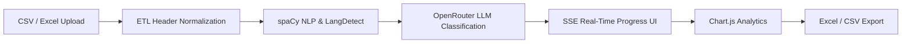

# 📄 Project Summary: AI Influencer Discovery & Analytics Dashboard

## 📌 Executive Overview
The **AI Influencer Discovery & Analytics Dashboard** is an enterprise-ready, full-stack Web application built with **Django 6.0.7**, **spaCy 3.8.14**, **OpenRouter API (OpenAI SDK)**, **PostgreSQL 15+**, **Bootstrap 5.3.2**, and **Chart.js 4.4.1**. The platform automates the end-to-end evaluation lifecycle of social media content creators—from multi-format dataset uploading (CSV/Excel) and text sanitization to multilingual Natural Language Processing (NLP), domain rule-based scoring, Large Language Model (LLM) classification with real-time Server-Sent Events (SSE) progress streaming, interactive analytics, and filter-aware export functionality.

---

## 🎯 Problem Statement & Objective
### Problem Statement
Organizations, public policy teams, and digital marketing leaders frequently analyze thousands of social media creator profiles across platforms (Instagram, YouTube, Twitter/X, LinkedIn, Facebook). Manual evaluation is slow, error-prone, and lacks standardized alignment metrics—especially when evaluating Hindi/multilingual content against specific national initiatives or niche domains.

### Core Objective
To engineer a scalable, robust, and automated Influencer Intelligence Pipeline that normalizes raw creator metadata, extracts domain entities, scores creator alignment via rule-based and LLM engines, visualizes metrics, and exports presentation-ready reports.

---

## ✨ Solution & Key Capabilities

1. **Robust Data ETL**: Ingests `.csv` and `.xlsx` files up to 10MB, normalizing 20+ header variations (e.g., `biography` ➔ `bio`, `follower count` ➔ `followers`) and parsing integer follower suffixes (`150K`, `3.5M`).
2. **Multilingual NLP Engine**: Automatically identifies content language (`langdetect`) and extracts named entities and noun chunks using spaCy (`en_core_web_sm`).
3. **Domain Rule Scoring**: Evaluates creators across four weighted domain groups (*Government Schemes*, *Development*, *Technology*, *Social*).
4. **LLM AI Classification**: Evaluates alignment against active search criteria using OpenRouter LLMs, returning scores (0–100), confidence ratings, reasoning, and clear recommendations (`RECOMMEND`, `MAYBE`, `REJECT`).
5. **Real-Time SSE Progress Engine**: Non-blocking streaming generator yielding Server-Sent Events (`text/event-stream`) to drive live UI progress bars, stage indicators, elapsed timers, and ETA estimates.
6. **Session & CSRF Security**: Custom `IsolatedSessionMiddleware` separating Django Admin sessions (`admin_sessionid`) from regular user sessions (`sessionid`), backed by `CSRF_USE_SESSIONS = True`.
7. **Enterprise Export Engine**: Generates styled `.xlsx` workbooks (`openpyxl`) with bold headers, auto-fitted columns, and top-row freeze panes, or streaming UTF-8 BOM `.csv` files.
8. **Pluggable Discovery Architecture**: Provider pattern (`BaseProvider`, `ProviderManager`, `MockProvider`) allowing dynamic creation of creator profiles with handle+platform deduplication.

---

## 🛠️ Technology Stack Overview

| Layer | Technologies Used |
|---|---|
| **Backend Framework** | Django `6.0.7`, Python `3.10+` / `3.12` |
| **Database** | PostgreSQL `15+` (Production) / SQLite3 (Development) |
| **AI Integration** | OpenRouter API (`nvidia/nemotron-3-ultra-550b-a55b:free`), OpenAI Python SDK `1.65.2` |
| **NLP & Language** | spaCy `3.8.14` (`en_core_web_sm`), `langdetect` `1.0.9` |
| **Frontend UI** | HTML5, Bootstrap `5.3.2`, Bootstrap Icons `1.11.1`, Vanilla CSS (`custom.css`) |
| **Frontend Scripting** | Vanilla JavaScript ES6 (EventSource SSE, Dynamic DOM, Bootstrap Tooltips) |
| **Visualizations** | Chart.js `4.4.1` |
| **Excel & Data Processing**| `openpyxl` `3.1.5`, `pandas` `2.2.3` |

---

## 🏗️ Major Application Modules

- `apps/authentication`: Custom `User` model, signin/signup logic, and `IsolatedSessionMiddleware`.
- `apps/uploads`: File upload handling, audit logging (`Upload` model), 10-row JSON preview, and header normalization utils.
- `apps/influencers`: Core `Influencer` model, spaCy NLP pipeline, OpenRouter LLM integration, SSE real-time stream endpoint, results filtering, Excel/CSV export engine, and discovery provider system.
- `apps/classification`: `SearchCriteria` and `Classification` models storing LLM evaluation responses.
- `apps/dashboard`: Dashboard home view, KPI statistics, and interactive Chart.js analytics.
- `apps/analytics`: `AnalyticsSnapshot` model and analytics aggregation handlers.

---

## 🧪 Testing & Verification Summary

- **Automated Test Coverage**: **21 / 21 Unit & Integration Tests Passed (100% Success Rate)**.
  - `apps.uploads.tests`: Normalization utils, follower parsing, empty bio null safety.
  - `apps.authentication.tests`: Admin cookie isolation, CSRF session isolation, staff blocking.
  - `apps.classification.tests`: SSE streaming endpoint content-type and event payload tests.
  - `apps.dashboard.tests`: Route resolution, sidebar navigation, zero `href="#"` links.
- **QA Synthetic Datasets**: 4 dataset generators (`Testing/generate_*_qa_data.py`) providing 500+ test rows featuring Hindi Unicode script (`हिंदी`), emojis (`🚀🇮🇳`), escaped quotes, multiline text, and duplicate handle edge cases.

---

## 🏁 Final Outcome
The project is fully implemented, verified, production-ready, and equipped with enterprise documentation suitable for immediate submission or deployment.
