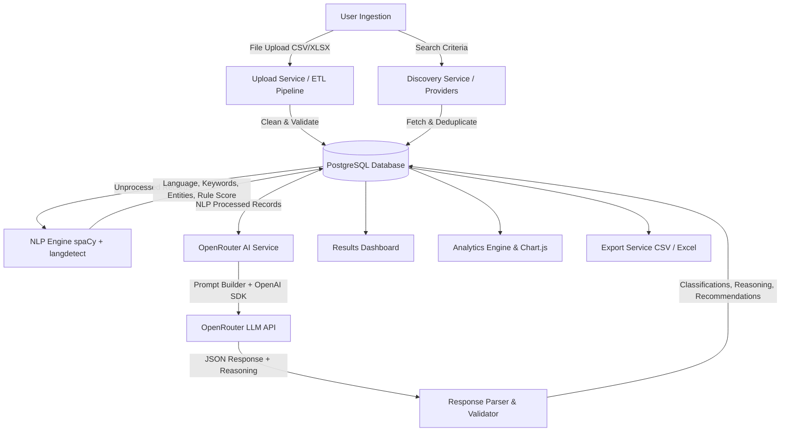

# 🌟 AI Influencer Discovery & Analytics Dashboard

[](https://www.python.org/)
[](https://www.djangoproject.com/)
[](https://www.postgresql.org/)
[](https://getbootstrap.com/)
[](https://spacy.io/)
[](https://openrouter.ai/)
[](LICENSE)
[](https://github.com/)

An enterprise-grade, AI-powered **Influencer Discovery, NLP Processing, and Analytics Dashboard** built with Django 6 and modern Web technologies. The platform enables organizations and public policy teams to upload large-scale influencer datasets via CSV/Excel, perform automated natural language processing (NLP) for language detection and keyword extraction, run rule-based scoring, execute LLM-driven AI classification via OpenRouter, and perform real-time influencer discovery using a provider-based architecture.

---

## 📋 Table of Contents

- [1. Project Title](#1-project-title)
- [2. Badges](#2-badges)
- [3. Table of Contents](#3-table-of-contents)
- [4. Project Overview](#4-project-overview)
- [5. Features](#5-features)
- [6. Screens / Modules](#6-screens--modules)
- [7. Architecture](#7-architecture)
- [8. Project Structure](#8-project-structure)
- [9. Technology Stack](#9-technology-stack)
- [10. Installation Guide](#10-installation-guide)
- [11. Environment Variables](#11-environment-variables)
- [12. Database Setup](#12-database-setup)
- [13. Running the Project](#13-running-the-project)
- [14. Authentication](#14-authentication)
- [15. Upload Workflow](#15-upload-workflow)
- [16. NLP Workflow](#16-nlp-workflow)
- [17. AI Classification Workflow](#17-ai-classification-workflow)
- [18. Results Dashboard](#18-results-dashboard)
- [19. Analytics Dashboard](#19-analytics-dashboard)
- [20. Export System](#20-export-system)
- [21. Real-Time Discovery](#21-real-time-discovery)
- [22. Folder Structure](#22-folder-structure)
- [23. API / Services](#23-api--services)
- [24. Future Improvements](#24-future-improvements)
- [25. Troubleshooting](#25-troubleshooting)
- [26. Contributing](#26-contributing)
- [27. License](#27-license)
- [28. Acknowledgements](#28-acknowledgements)
- [29. Author](#29-author)
- [30. Final Project Summary](#30-final-project-summary)

---

## 🎯 4. Project Overview

### What Problem This Project Solves
Identifying aligned, high-impact content creators across platforms (Instagram, YouTube, Twitter, LinkedIn, etc.) often requires manually reviewing thousands of bios, social profiles, follower metrics, and past content. Existing tools lack nuanced sentiment and domain relevance scoring tailored to national initiatives, government schemes, and localized languages.

### Why It Was Built
This system was built to automate the end-to-end influencer evaluation pipeline—from multi-format data ingestion and automated text cleaning to multilingual NLP feature extraction, rule-based scoring, and deep AI semantic classification powered by Large Language Models via OpenRouter.

### How It Works
1. **Data Ingestion**: Users upload CSV or Excel files containing raw creator metadata or discover creators real-time via external provider APIs.
2. **ETL Pipeline**: The system cleans text, normalizes platform headers, handles follower count suffixes (`12K`, `3.5M`), detects duplicates, and stores sanitized data.
3. **NLP Processing**: spaCy (`en_core_web_sm`) extracts noun chunks and named entities, `langdetect` detects languages (e.g., Hindi, English), and a rule-based engine scores alignment across key policy domains.
4. **AI Classification**: OpenRouter API (`nvidia/nemotron-3-ultra-550b-a55b:free` or custom LLM) evaluates creator profiles against user search criteria, returning structured JSON with overall scores, confidence scores, reasoning, and recommendations.
5. **Dashboard & Export**: Interactive analytical dashboards visualize creator metrics via Chart.js, while filtered reports can be exported to Excel (`.xlsx`) or UTF-8 BOM CSV.

### Target Users
- Public policy and communications teams tracking digital outreach alignment.
- Brand marketing leads looking for targeted creator partnerships across social platforms.
- Data analysts requiring automated multilingual NLP and AI categorization of creator profiles.

---

## ✨ 5. Features

- **Custom Authentication**: Custom Django User Model with dual Username/Email login support, secure session management ("Remember Me"), and staff access restriction on frontend routes.
- **Robust ETL Data Ingestion**: Supports `.csv` and `.xlsx` files up to 10MB with automated header normalization mapping 20+ header variations (e.g., `follower count` ➔ `followers`, `biography` ➔ `bio`).
- **Follower Count Normalization**: Smart parser converts formatted numbers like `12K`, `3.5M`, `1.2B`, or `45,000` into exact integer representations.
- **Multilingual NLP Engine**: Integrated spaCy pipeline for lemmatization, noun chunk extraction, entity recognition (NER), and `langdetect` for automatic language detection.
- **Rule-Based Scoring Engine**: Evaluates creators across four weighted domain groups: *Government Schemes*, *Development*, *Technology*, and *Social*.
- **OpenRouter AI Classification**: Connects via the OpenAI Python SDK to OpenRouter LLMs using JSON enforcement, reasoning mode, and exponential backoff retry mechanisms.
- **Real-Time Discovery Provider Architecture**: Pluggable provider architecture (`BaseProvider`, `ProviderManager`, `MockProvider`) allowing dynamic fetching of creators outside of file uploads with duplicate prevention.
- **Interactive Analytics Dashboard**: Live Chart.js visualizations covering language distribution, platform split, score buckets, recommendation ratios, orientation matches, and upload/classification trends over time.
- **Advanced Results Management**: Global search, multi-field filtering (platform, language, recommendation, score range, follower range, source), sorting, and paginated table/card views.
- **Enterprise Export System**: Instant export of filtered or selected creator records to formatted Excel (`openpyxl` styling, auto-fitted columns, frozen panes) or UTF-8 BOM CSV.

---

## 🖥️ 6. Screens / Modules

| Module Name | Description | Key URL Pattern |
| :--- | :--- | :--- |
| **Authentication** | Registration, Login (Username/Email), Password Reset flow, Logout | `/login/`, `/signup/`, `/forgot-password/` |
| **Dashboard Home** | High-level summary metrics, processing statistics, and recent uploads | `/dashboard/` |
| **Uploads** | Multi-format upload portal, processing progress, upload history, and 10-row JSON preview | `/uploads/`, `/uploads/history/`, `/uploads/preview/<id>/` |
| **NLP Dashboard** | Batch NLP execution engine, language breakdown, and rule score aggregations | `/influencers/nlp/` |
| **AI Classification** | OpenRouter LLM batch classification trigger and execution progress tracking | `/influencers/ai-classification/` |
| **Results Dashboard** | Searchable, filterable table/cards of classified influencers with detailed drawer views | `/influencers/results/`, `/influencers/results/<id>/` |
| **Analytics Dashboard** | Full-screen interactive charts, KPI cards, top 5 lists, and custom date range filters | `/dashboard/analytics/` |
| **Export System** | On-demand generation of styled Excel workbooks and streaming CSV files | `/influencers/results/export/` |
| **Real-Time Discovery**| Dynamic creator discovery via external provider APIs | `/influencers/discovery/` |

---

## 🏗️ 7. Architecture

The application implements a decoupled, multi-tier service architecture built on top of Django's MVT pattern.



---

## 📂 8. Project Structure

```text
AI_Influence_Dashboard/
├── apps/
│   ├── authentication/     # Custom user model, login/signup forms, password reset views
│   ├── classification/     # Classification & SearchCriteria models
│   ├── dashboard/          # Home summary view, Analytics service, Chart.js payload builder
│   ├── influencers/        # Core influencer model, NLP service, OpenRouter service, Discovery providers, Export service
│   └── uploads/            # File upload model, pandas parsing service, header normalizer, 10-row preview generator
├── config/                 # Django settings, WSGI, ASGI, and root URL routing
├── static/                 # CSS (custom styling), JavaScript (analytics.js, dashboard.js), Vendor assets
├── templates/              # Modular HTML5 templates (Base, Auth, Uploads, Influencers, Results, Analytics)
├── utils/                  # Common abstract models (TimeStampedModel)
├── manage.py               # Django CLI management entrypoint
├── requirements.txt        # Python dependency manifest
├── .env.example            # Environment configuration template
└── README.md               # Project documentation
```

---

## 🛠️ 9. Technology Stack

### Backend
- **Framework**: Django 6.0.7
- **Language**: Python 3.10+
- **Database Driver**: `psycopg` 3.3.4 (PostgreSQL 15+)
- **Data Processing**: `pandas` 3.0.5, `openpyxl` 3.1.5

### Artificial Intelligence & NLP
- **AI API Gateway**: OpenRouter API (`https://openrouter.ai/api/v1`)
- **AI SDK**: `openai` 2.50.0 Python SDK (Custom Base URL integration)
- **Default AI Model**: `nvidia/nemotron-3-ultra-550b-a55b:free`
- **NLP Library**: `spacy` 3.8.14 (`en_core_web_sm` model)
- **Language Detection**: `langdetect` 1.0.9

### Frontend & UI
- **Styling**: Bootstrap 5.3.2 CSS Framework
- **Icons**: Bootstrap Icons 1.11.1
- **Visualizations**: Chart.js 4.x
- **Templates**: Django HTML5 Template Engine

---

## ⚙️ 10. Installation Guide

Follow these steps to set up the project locally.

### Prerequisites
- Python 3.10 or higher
- PostgreSQL database server installed and running
- `pip` and `virtualenv` tools

### Step-by-Step Setup

1. **Clone the Repository**:
   ```bash
   git clone https://github.com/YourUsername/AI_Influence_Dashboard.git
   cd AI_Influence_Dashboard
   ```

2. **Create and Activate Virtual Environment**:
   ```bash
   python3 -m venv venv
   source venv/bin/activate  # On Windows: venv\Scripts\activate
   ```

3. **Install Dependencies**:
   ```bash
   pip install --upgrade pip
   pip install -r requirements.txt
   ```

4. **Download spaCy Language Model**:
   ```bash
   python -m spacy download en_core_web_sm
   ```

5. **Configure Environment Variables**:
   ```bash
   cp .env.example .env
   ```
   *Edit `.env` with your PostgreSQL database credentials and OpenRouter API key.*

---

## 🔑 11. Environment Variables

Below is the complete reference of environment variables required in `.env`:

| Variable Name | Default Value | Description |
| :--- | :--- | :--- |
| `DEBUG` | `True` | Enables Django debug mode (`True` for dev, `False` for prod). |
| `ALLOWED_HOSTS` | `localhost,127.0.0.1` | Comma-separated list of allowed hostnames. |
| `SECRET_KEY` | *Django Insecure Key* | Django cryptographic signing key. Change in production. |
| `OPENROUTER_API_KEY` | `""` | Your OpenRouter API key. |
| `OPENROUTER_MODEL_NAME` | `nvidia/nemotron-3-ultra-550b-a55b:free` | Target LLM model hosted on OpenRouter. |
| `OPENROUTER_BASE_URL` | `https://openrouter.ai/api/v1` | OpenRouter OpenAI-compatible endpoint. |
| `OPENROUTER_TIMEOUT` | `30` | HTTP request timeout in seconds. |
| `OPENROUTER_MAX_RETRIES` | `3` | Maximum retry attempts for failed AI calls. |
| `DB_NAME` | `influencer_db` | PostgreSQL Database name. |
| `DB_USER` | `influencer_user` | PostgreSQL Database user. |
| `DB_PASSWORD` | `password` | PostgreSQL Database user password. |
| `DB_HOST` | `localhost` | Database host server address. |
| `DB_PORT` | `5432` | Database server port. |
| `DISCOVERY_ENABLED` | `True` | Flag to enable or disable real-time discovery feature. |
| `DEFAULT_PROVIDER` | `mock` | Default active provider for real-time discovery. |
| `DISCOVERY_TIMEOUT` | `30` | Timeout in seconds for discovery API requests. |
| `MAX_DISCOVERY_RESULTS` | `5` | Limit of creators fetched per discovery request. |

---

## 🗄️ 12. Database Setup

Ensure PostgreSQL is running and your target database (`influencer_db`) is created:

```bash
# Log in to PostgreSQL CLI
psql -U postgres

# Create Database and User
CREATE DATABASE influencer_db;
CREATE USER influencer_user WITH PASSWORD 'password';
GRANT ALL PRIVILEGES ON DATABASE influencer_db TO influencer_user;
\q
```

Run Django Database Migrations:

```bash
python manage.py makemigrations
python manage.py migrate
```

Create a Django Admin Superuser:

```bash
python manage.py createsuperuser
```

Collect Static Files (for production deployment):

```bash
python manage.py collectstatic --noinput
```

---

## 🚀 13. Running the Project

Start the Django development server:

```bash
python manage.py runserver
```

### Access URLs
- **Main Dashboard Overview**: [http://127.0.0.1:8000/dashboard/](http://127.0.0.1:8000/dashboard/)
- **File Upload Portal**: [http://127.0.0.1:8000/uploads/](http://127.0.0.1:8000/uploads/)
- **NLP Processing Engine**: [http://127.0.0.1:8000/influencers/nlp/](http://127.0.0.1:8000/influencers/nlp/)
- **AI Classification Engine**: [http://127.0.0.1:8000/influencers/ai-classification/](http://127.0.0.1:8000/influencers/ai-classification/)
- **Results Dashboard**: [http://127.0.0.1:8000/influencers/results/](http://127.0.0.1:8000/influencers/results/)
- **Analytics Dashboard**: [http://127.0.0.1:8000/dashboard/analytics/](http://127.0.0.1:8000/dashboard/analytics/)
- **Real-Time Discovery**: [http://127.0.0.1:8000/influencers/discovery/](http://127.0.0.1:8000/influencers/discovery/)
- **Django Admin Panel**: [http://127.0.0.1:8000/admin/](http://127.0.0.1:8000/admin/)

---

## 🔒 14. Authentication Workflow

The authentication system leverages a custom user model `apps.authentication.models.User` extending `AbstractUser`.

- **Flexible Login (`CustomLoginForm`)**: Users can log in using either their **Username** or registered **Email address**.
- **Admin Access Protection**: Staff and Superusers are blocked from logging into the public frontend interface via `confirm_login_allowed`, directing them strictly to `/admin/`.
- **Session Security ("Remember Me")**:
  - If "Remember Me" is checked: Session remains active for 2 weeks (`SESSION_COOKIE_AGE = 1209600`).
  - If unchecked: Session cookie expires immediately upon browser closure (`request.session.set_expiry(0)`).
- **Password Management**: Includes full email-based password reset workflows (`CustomPasswordResetForm`, `CustomSetPasswordForm`).

---

## 📤 15. Upload Workflow

```text
[ File Upload ] ➔ [ File Validation ] ➔ [ Column Mapping ] ➔ [ Data Cleaning ] ➔ [ Bulk DB Insert ]
```

1. **Validation (`validate_file`)**:
   - File size must be $\le$ 10MB.
   - File format must be `.csv` or `.xlsx`.
   - File must not be empty.
2. **Column Normalization (`normalize_headers`)**:
   - Converts headers to lowercase and replaces spaces with underscores.
   - Applies `HEADER_MAPPING` to standardize variations like `follower count`, `username`, `biography`, `url`.
3. **Data Cleaning & Parsing (`clean_text`, `parse_followers`)**:
   - Strips whitespace and duplicate spaces.
   - Converts strings (`"15.5K"`, `"2M"`, `"45,000"`) to standard integers.
   - Normalizes platform strings (`"Instagram"`, `"yt"`, `"x.com"`) into model choices.
4. **Processing Summary & Preview**:
   - Stores first 10 sanitized rows in `Upload.preview_data` as JSON.
   - Performs atomic bulk database insertion (`bulk_create` with `ignore_conflicts=True`).
   - Saves statistics: total rows, imported count, duplicate count, invalid count, and execution time.

---

## 🔬 16. NLP Workflow

The NLP pipeline extracts structured linguistic data before sending records to the AI LLM.

1. **Text Preparation (`clean_text_for_nlp`)**:
   - Merges creator `bio` and `description`.
   - Strips URLs, email addresses, phone numbers, emojis, and special punctuation while preserving hashtag/mention text.
2. **Language Detection (`detect_language`)**:
   - Uses `langdetect.detect_langs()` to infer content language.
   - Maps ISO language codes (e.g., `'hi'` ➔ `'Hindi'`, `'en'` ➔ `'English'`) along with confidence probabilities.
3. **Feature Extraction (`extract_nlp_features`)**:
   - Uses spaCy (`en_core_web_sm`) to parse lemmatized noun chunks and individual nouns/proper nouns.
   - Extracts named entities (`doc.ents`) categorized by entity type (`PERSON`, `ORG`, `GPE`, etc.).
4. **Rule-Based Domain Scoring (`calculate_rule_based_score`)**:
   - Matches extracted tokens against four predefined domain keyword groups:
     - `government_schemes`: *digital india*, *startup india*, *pm kisan*, *upi*, *make in india*, etc.
     - `development`: *infrastructure*, *education*, *healthcare*, *agriculture*, *growth*, etc.
     - `technology`: *ai*, *digital*, *software*, *tech*, *cyber*, etc.
     - `social`: *community*, *welfare*, *youth*, *women*, etc.
   - Scores +25.0 points per matched domain group (Max 100.0%).

---

## 🤖 17. AI Classification Workflow

```text
[ Influencer Record + Criteria ] ➔ [ Prompt Builder ] ➔ [ OpenRouter LLM ] ➔ [ JSON Response Parser ] ➔ [ Classification Record ]
```

1. **Prompt Construction (`build_classification_prompt`)**:
   - Compiles creator bio, description, followers, language, extracted keywords, entities, and rule scores into a structured JSON prompt payload.
   - Inject user's active `SearchCriteria` (or default evaluation criteria).
   - Enforces strict JSON-only output constraints without markdown wrappers.
2. **OpenRouter API Execution (`OpenRouterService`)**:
   - Executes chat completion request via the OpenAI SDK targeting `settings.OPENROUTER_MODEL_NAME`.
   - Configures reasoning mode (`extra_body={"reasoning": {"enabled": True}}`) and low temperature (`0.1`).
   - Features exponential backoff retries ($1s \rightarrow 2s \rightarrow 4s$) up to `OPENROUTER_MAX_RETRIES`.
3. **Response Parsing & Validation (`parse_ai_response`)**:
   - Strips residual markdown fences (` ```json ... ``` `).
   - Validates existence of required keys: `overall_score`, `confidence_score`, `recommendation`, `reason`.
   - Maps AI recommendations (`Highly Relevant`, `Relevant`, `Not Relevant`) to Django model choices (`RECOMMEND`, `MAYBE`, `REJECT`).
   - Stores full raw JSON response, model name, processing time, and summary in `Classification`.

---

## 📊 18. Results Dashboard

The **Results List View** (`/influencers/results/`) provides search, multi-field filtering, sorting, and pagination.

### Features
- **Global Search**: Instant text search across creator names, handles, platforms, detected languages, matched keywords, and recommendations.
- **Advanced Filters**: Filter by platform, language, recommendation rating (`Recommend`, `Maybe`, `Reject`), source (`Uploaded`, `Mock Provider`), minimum/maximum overall score, and follower count ranges.
- **Dynamic Sorting**: Sort by overall score (desc/asc), follower count (desc/asc), creator name (asc/desc), platform, date created, and confidence score.
- **Paginated Output**: Standard 25 records per page with active filter preservation across pages.
- **Detailed Drawer / View**: Inspect score breakdown cards, reasoning explanations, extracted entities, and rule-based keyword matches.

---

## 📈 19. Analytics Dashboard

The **Analytics Dashboard** (`/dashboard/analytics/`) turns stored data into actionable visual metrics.

### Key Components
- **KPI Overview Cards**: Total Uploads, Total Creators, Total Classified, Highly Relevant Count, Moderately Relevant Count, Low Match Count, Average AI Score, Average Confidence, Average Rule Score.
- **Interactive Chart.js Visualizations**:
  1. *Language Distribution* (Pie Chart)
  2. *Platform Distribution* (Bar Chart)
  3. *AI Score Buckets* (0-20, 21-40, 41-60, 61-80, 81-100) (Bar Chart)
  4. *Recommendation Ratio* (Pie Chart)
  5. *Orientation Alignment* (Bar Chart)
  6. *Follower Count Segments* (0-10K, 10K-50K, 50K-100K, 100K-500K, 500K-1M, 1M+) (Bar Chart)
  7. *Upload Trends over Time* (Line Chart)
  8. *Classification Trends over Time* (Line Chart)
- **Top 5 Analytical Lists**: Top Platforms, Top Detected Languages, Top Extracted Keywords, Top Government Scheme Mentions.
- **Date Range Filters**: Presets for *Today*, *7 Days*, *30 Days*, *90 Days*, *This Year*, or *Custom Date Ranges*.

---

## 📥 20. Export System

The export service (`apps.influencers.services.export_service`) enables reports generation.

### Supported Formats
1. **Excel Workbooks (`.xlsx`)**:
   - Built using `openpyxl`.
   - Includes styled header fill colors (`#D3D3D3`), bold text, frozen panes (`A2`), auto-filter headers, auto-calculated column widths (capped at 50 characters), and text wrapping.
2. **CSV Files (`.csv`)**:
   - Streaming `StreamingHttpResponse` for memory efficiency.
   - Prefixed with UTF-8 Byte Order Mark (`\ufeff`) to ensure native Unicode (e.g., Hindi text) rendering when opened in Microsoft Excel.

### Export Modes
- **Filtered Export**: Exports all records matching current search and filter criteria.
- **Selected Export**: Exports explicitly checked creator rows via checkbox selection.

---

## 🔍 21. Real-Time Discovery

The discovery module allows real-time creator searching via external provider APIs without manual file uploads.

### Provider Architecture
- **`BaseProvider` (Abstract Class)**: Defines the common interface contract (`name`, `search()`).
- **`ProviderManager`**: Registry class that reads `settings.DEFAULT_PROVIDER` and returns active provider instances.
- **`MockProvider`**: Built-in mock provider that generates synthetic, realistic creator profiles matching search criteria with simulated latency for testing pipelines.

### Automated Discovery Flow
```text
[ Search Criteria ] ➔ [ Provider Manager ] ➔ [ Provider Search ] ➔ [ Deduplication Check ] ➔ [ Auto-Save ] ➔ [ Auto-NLP ] ➔ [ Auto-AI Classification ]
```
1. Queries active provider (`MockProvider` or future API providers).
2. Checks database for duplicates using `external_id` + `source` or `handle` + `platform`.
3. Creates new `Influencer` records linked directly to `request.user` (`source='MOCK'`).
4. Automatically triggers the **NLP Pipeline** on discovered records.
5. Automatically triggers **OpenRouter AI Classification**.

---

## 📁 22. Detailed Folder Structure

```text
.
├── apps/
│   ├── authentication/
│   │   ├── admin.py
│   │   ├── apps.py
│   │   ├── forms.py            # CustomLoginForm, CustomUserCreationForm, CustomPasswordResetForm
│   │   ├── models.py           # User (extends AbstractUser)
│   │   ├── urls.py             # Auth routing
│   │   └── views.py            # Login, Signup, Logout views
│   ├── classification/
│   │   ├── admin.py
│   │   ├── apps.py
│   │   ├── models.py           # SearchCriteria, Classification models
│   │   └── views.py
│   ├── dashboard/
│   │   ├── admin.py
│   │   ├── apps.py
│   │   ├── services/
│   │   │   ├── analytics_service.py # KPI calculation, summary stats, top lists
│   │   │   └── chart_service.py    # Chart.js data formatting
│   │   ├── urls.py
│   │   └── views.py            # Home view & Analytics dashboard view
│   ├── influencers/
│   │   ├── admin.py
│   │   ├── apps.py
│   │   ├── forms.py            # ResultFilterForm
│   │   ├── models.py           # Influencer model
│   │   ├── providers/
│   │   │   ├── base_provider.py # Abstract base class
│   │   │   └── mock_provider.py # Simulated external API provider
│   │   ├── services/
│   │   │   ├── discovery_service.py   # Discovery orchestrator
│   │   │   ├── export_service.py      # Excel & CSV streaming export
│   │   │   ├── nlp_service.py         # Batch & single NLP processing
│   │   │   ├── openrouter_service.py  # OpenRouter API client & retries
│   │   │   ├── prompt_builder.py      # Prompt construction
│   │   │   ├── provider_manager.py    # Provider registry manager
│   │   │   ├── response_parser.py     # AI response cleaner & JSON validator
│   │   │   └── result_service.py       # Filter & sort query builder
│   │   ├── urls.py
│   │   ├── utils.py            # spaCy loader, langdetect, rule-based scoring
│   │   └── views.py            # NLP, AI Classification, Results, Detail, Export, Discovery
│   └── uploads/
│       ├── admin.py
│       ├── apps.py
│       ├── forms.py            # UploadFileForm
│       ├── models.py           # Upload model
│       ├── services.py         # Pandas file parsing, ETL, bulk creation
│       ├── urls.py
│       ├── utils.py            # Header normalization, text cleaning, follower count parsing
│       └── views.py            # Upload, Upload History, Preview views
├── config/
│   ├── asgi.py
│   ├── settings.py             # Project settings, DB config, OpenRouter config
│   ├── urls.py                 # Root URL configuration
│   └── wsgi.py
├── static/
│   ├── css/
│   │   └── custom.css          # Custom styling rules
│   └── js/
│       ├── analytics.js        # Chart.js initialization script
│       └── dashboard.js        # UI interaction scripts
├── templates/                  # Modular HTML templates
├── utils/
│   └── models.py               # TimeStampedModel abstract base class
├── .env.example                # Sample environment file
├── manage.py
└── requirements.txt
```

---

## 🧩 23. API / Services Summary

| Service Class | Responsibility | Primary Methods |
| :--- | :--- | :--- |
| **`OpenRouterService`** | Manages requests to OpenRouter API via OpenAI SDK with exponential retries. | `classify_influencer(influencer, criteria)` |
| **`NLPService`** | Orchestrates text cleaning, language detection, spaCy feature extraction, and rule scoring. | `process_influencer_nlp(influencer)`, `batch_process_nlp(user)` |
| **`DiscoveryService`** | Executes real-time discovery via active provider, handles deduplication, and triggers NLP/AI pipelines. | `execute(user, criteria)` |
| **`ExportService`** | Generates styled Excel workbooks or streaming UTF-8 BOM CSV responses. | `generate_excel_response()`, `generate_csv_response()`, `get_export_queryset()` |
| **`AnalyticsService`**| Computes KPI aggregations, summary statistics, top 5 lists, and recent activity logs. | `get_analytics_context(user, filters)` |
| **`ChartService`** | Formats database query aggregations into Chart.js compatible JSON structures. | `get_chart_data(influencer_qs, classification_qs, upload_qs)` |
| **`ResultService`** | Builds optimized Django QuerySets with global search, filters, and sorting. | `get_filtered_classifications(user, query_params)` |
| **`ProviderManager`** | Implements registry pattern to retrieve active discovery provider. | `get_active_provider()` |

---

## 🔮 24. Future Improvements

- **Live Social Media API Providers**: Integrate production API providers (`InstagramProvider`, `YouTubeProvider`, `LinkedInProvider`, `TwitterProvider`).
- **Asynchronous Task Queues**: Implement Celery and Redis for handling large multi-thousand row file uploads and batch AI classifications in background workers.
- **Multilingual spaCy Models**: Add support for Hindi (`hi_core_news_sm`) and other regional spaCy language models.
- **Custom Criteria Management UI**: Build a frontend form builder for users to dynamically create, edit, and save custom `SearchCriteria` sets.
- **Real-Time Progress Updates**: Integrate WebSockets via Django Channels to display live progress bars for batch processing and discovery runs.

---

## ❓ 25. Troubleshooting

### 1. Missing spaCy Language Model Error
**Symptom**: `RuntimeError: spaCy model 'en_core_web_sm' not found.`
**Solution**:
```bash
python -m spacy download en_core_web_sm
```

### 2. PostgreSQL Connection Failure
**Symptom**: `psycopg.OperationalError: could not connect to server`
**Solution**: Verify PostgreSQL is running and check `.env` configuration (`DB_NAME`, `DB_USER`, `DB_PASSWORD`, `DB_HOST`, `DB_PORT`).

### 3. OpenRouter API Key Missing or Invalid
**Symptom**: `openai.AuthenticationError` or empty AI responses.
**Solution**: Ensure `OPENROUTER_API_KEY` in `.env` contains a valid OpenRouter API key with sufficient balance/quota.

### 4. Database Migrations Out of Sync
**Symptom**: `django.db.utils.ProgrammingError: relation "..." does not exist`
**Solution**:
```bash
python manage.py makemigrations
python manage.py migrate
```

---

## 🤝 26. Contributing

Contributions are welcome! Follow these steps to contribute:

1. **Fork the Repository**.
2. **Create a Feature Branch**:
   ```bash
   git checkout -b feature/AmazingFeature
   ```
3. **Commit your Changes**:
   ```bash
   git commit -m "Add some AmazingFeature"
   ```
4. **Push to the Branch**:
   ```bash
   git push origin feature/AmazingFeature
   ```
5. **Open a Pull Request**.

---

## 📄 27. License

Distributed under the **MIT License**. See `LICENSE` for more information.

---

## 🙏 28. Acknowledgements

- **[Django Software Foundation](https://www.djangoproject.com/)** for the web framework.
- **[spaCy](https://spacy.io/)** for natural language processing capabilities.
- **[OpenRouter](https://openrouter.ai/)** for LLM API infrastructure.
- **[Bootstrap](https://getbootstrap.com/)** for responsive frontend UI components.
- **[Pandas](https://pandas.pydata.org/)** & **[openpyxl](https://openpyxl.readthedocs.io/)** for data parsing and Excel generation.
- **[Chart.js](https://www.chartjs.org/)** for interactive data visualizations.

---

## 👤 29. Author

**Vaibhav Sharma**  
Full-Stack Developer  
- **GitHub**: [@SharmaVaibhav976531](https://github.com/SharmaVaibhav976531)

---

## 📝 30. Final Project Summary

The **AI Influencer Discovery Dashboard** represents a modern, production-grade Django web application designed for automated creator identification, natural language analysis, rule-based domain scoring, and AI-powered evaluation. Combining robust ETL file processing, spaCy NLP pipelines, OpenRouter LLM integration, and interactive Chart.js analytics, it provides an end-to-end workflow for discovering and analyzing digital influencers at scale.
