# 🌟 AI Influencer Discovery & Analytics Dashboard

[](https://www.python.org/)
[](https://www.djangoproject.com/)
[](https://www.postgresql.org/)
[](https://getbootstrap.com/)
[](https://spacy.io/)
[](https://openrouter.ai/)
[](LICENSE)
[](https://github.com/)

An enterprise-grade, AI-powered **Influencer Discovery, NLP Processing, and Analytics Dashboard** built with Django 6 and modern Web technologies. The platform enables organizations, communications leads, and public policy teams to ingest large-scale influencer datasets (CSV/Excel), perform automated Natural Language Processing (NLP) for language detection and keyword extraction, execute rule-based scoring, run LLM-driven AI classification via OpenRouter with real-time SSE progress tracking, visualize analytics using interactive Chart.js charts, and discover new content creators dynamically through a pluggable provider engine.

---

## 📋 Table of Contents

1. [Project Title](#-ai-influencer-discovery--analytics-dashboard)
2. [Project Overview](#-2-project-overview)
3. [Features](#-3-features)
4. [Application Screenshots](#-4-application-screenshots)
5. [Technology Stack](#-5-technology-stack)
6. [Project Architecture](#-6-project-architecture)
7. [Project Structure](#-7-project-structure)
8. [Installation Guide](#-8-installation-guide)
9. [Environment Variables](#-9-environment-variables)
10. [Usage Guide](#-10-usage-guide)
11. [Workflow](#-11-workflow)
12. [Database Design](#-12-database-design)
13. [AI Classification](#-13-ai-classification)
14. [NLP Engine](#-14-nlp-engine)
15. [Analytics](#-15-analytics)
16. [Export System](#-16-export-system)
17. [Discovery System](#-17-discovery-system)
18. [Error Handling & Logging](#-18-error-handling--logging)
19. [Testing & QA Datasets](#-19-testing--qa-datasets)
20. [Performance & Optimizations](#-20-performance--optimizations)
21. [Security & Session Isolation](#-21-security--session-isolation)
22. [API Overview](#-22-api-overview)
23. [Known Limitations](#-23-known-limitations)
24. [Future Improvements](#-24-future-improvements)
25. [Contributing](#-25-contributing)
26. [License](#-26-license)
27. [Author](#-27-author)
28. [Acknowledgements](#-28-acknowledgements)
29. [Project Status](#-29-project-status)

---

## 🎯 2. Project Overview

### Why This Project Exists
Identifying aligned, high-impact content creators across social media platforms (Instagram, YouTube, Twitter/X, LinkedIn, Facebook) traditionally requires manually analyzing thousands of bios, social posts, follower counts, and campaign objectives. Existing marketing platforms often lack fine-grained domain alignment scoring for public policy, national development initiatives, or localized non-English content.

### What Problem It Solves
This dashboard automates the end-to-end creator evaluation lifecycle:
- **Data Ingestion**: Multi-format ETL uploading with automatic header mapping (20+ variations) and numerical follower parsing (`150K`, `3.5M`).
- **Multilingual NLP**: Instant language identification (Hindi, English, Mixed) and keyword extraction using spaCy and rule-based scoring engines.
- **LLM AI Classification**: Evaluation of creator alignment against active search criteria using OpenRouter LLMs, providing overall scores, confidence metrics, reasoning, and clear recommendations (`RECOMMEND`, `MAYBE`, `REJECT`).
- **Real-Time Visibility**: Server-Sent Events (SSE) stream progress updates, stage indicators, terminal logs, and live ETA metrics to the UI during batch execution.
- **Analytics & Export**: Comprehensive Chart.js visualizations and formatted Excel (`.xlsx`) or UTF-8 BOM CSV exports.

### Who Can Use It
- **Public Policy & Communications Teams**: Track creator alignment for social initiatives (e.g., Digital India, Skill India).
- **Brand Marketing Leads**: Source, score, and evaluate influencers for targeted niche campaigns.
- **Data Engineers & Analysts**: Batch-process large social media creator lists with standardized NLP and LLM metadata.

### Real-World Use Case
A communications agency needs to evaluate 500 regional tech creators for a national digital literacy campaign. They upload a raw CSV dataset into the dashboard. The system cleans text, extracts keywords (e.g., *UPI*, *Tech Tips*), identifies creators posting in Hindi or English, runs OpenRouter AI classification to calculate alignment scores, and streams real-time execution progress to the dashboard. Analysts then filter for top-tier creators scoring above 80% and export a formatted Excel report.

---

## ✨ 3. Features

### 🔑 Authentication & Session Security
- **Dual Credential Sign-in**: Support for both username and email address authentication.
- **Session Isolation Middleware**: Custom `IsolatedSessionMiddleware` separating Django Admin sessions (`admin_sessionid`) from application user sessions (`sessionid`) to eliminate cookie collision bugs.
- **CSRF Session Protection**: `CSRF_USE_SESSIONS = True` storing CSRF tokens directly in session state to prevent HTTP 403 CSRF verification failures.
- **Staff Access Restriction**: Prevents staff/superusers from logging into frontend application routes while reserving `/admin/` access.

### 📊 Dashboard & Overview
- **Key Performance Indicators**: High-level counters for total influencers, processed records, completed classifications, and pending queues.
- **Recent Upload Activity**: Live tracking of recent CSV/Excel file uploads and current execution status.
- **Quick Action Portals**: Direct shortcuts to Uploads, NLP Engine, AI Classification, Results, and Analytics.

### 📁 Upload System & ETL Ingestion
- **Multi-Format Ingestion**: Supports `.csv` and `.xlsx` files up to 10MB.
- **Automatic Header Normalization**: Mappings for 20+ header variations (e.g., `biography` ➔ `bio`, `follower count` ➔ `followers`, `creator_name` ➔ `name`).
- **Follower Count Normalization**: Smart parser converts formatted strings like `150K`, `3.5M`, `1.2B`, or `45,000` into integer counts.
- **Null Safety & Cleaning**: Eliminates database `NOT NULL` constraint violations by converting empty text, whitespace, and `NaN` values to default safe strings.
- **File Upload History**: Interactive audit log tracking uploaded files, file sizes, processing status (`COMPLETED`, `FAILED`), and record counts.
- **10-Row JSON Data Preview**: Interactive modal previewing cleaned data before running NLP or AI jobs.

### 🧠 Multilingual NLP Engine
- **Language Detection**: Automatically detects content language using `langdetect` and fallback heuristics (e.g., *Hindi*, *English*, *Mixed*).
- **Keyword & Entity Extraction**: Integrates spaCy (`en_core_web_sm`) for Noun Chunk extraction, Named Entity Recognition (NER), and key term tagging.
- **Domain Rule-Based Scoring Engine**: Scores creators across four weighted domain groups (*Government Schemes*, *Development*, *Technology*, *Social*).
- **Unicode & Emoji Support**: Sanitizes and retains Devanagari text (`हिंदी`), emojis (`🚀🇮🇳`), and special characters without corrupting text buffers.

### 🤖 OpenRouter AI Classification
- **LLM Integration**: Connects via OpenAI Python SDK to OpenRouter API models (e.g., `nvidia/nemotron-3-ultra-550b-a55b:free`).
- **Structured Prompt Builder**: Constructs strict JSON-enforced system prompts containing creator metadata and target search criteria.
- **Response Parser**: Strips markdown code blocks and validates required JSON response keys (`overall_score`, `confidence_score`, `recommendation`, `reason`, `summary`).
- **Exponential Backoff Retries**: Handles API rate limits (`429`) and timeouts with automatic retries (1s, 2s, 4s).
- **Real-Time Progress Streaming (SSE)**: `StreamingHttpResponse` emitting `text/event-stream` updates (`start`, `stage_update`, `item_complete`, `complete`) to drive live UI progress bars, stage indicators, elapsed timers, and ETA estimates.
- **Structured Terminal Logging**: Outputs clean execution banners and step-by-step progress metrics to the console.

### 🔍 Results Management, Search & Filtering
- **Multi-Field Filter Form**: Filter creators by Platform, Language, Recommendation (`RECOMMEND`, `MAYBE`, `REJECT`), Score Range (0–100), Follower Range, and Search Keywords.
- **Sorting Options**: Sort by Overall Score, Follower Count, Name, or Creation Date.
- **Paginated Table & Card Views**: Seamless navigation across large result sets with 10 records per page.
- **Detailed Creator Modal/Page**: Inspect complete AI analysis summaries, matched keywords, confidence scores, raw JSON responses, and social links.

### 📈 Interactive Analytics Engine
- **Chart.js Visualizations**: Live interactive charts covering Language Distribution (Doughnut), Platform Split (Bar), Overall Score Buckets (Bar), Recommendation Ratio (Pie), and Trend Over Time (Line).
- **Top 5 Lists**: Highlights top recommended creators, highest follower accounts, and top NLP scoring influencers.

### 📥 Export System
- **Formatted Excel Export**: Generates styled `.xlsx` workbooks using `openpyxl` with bold headers, auto-fitted column widths, frozen top row, and cell alignment.
- **UTF-8 BOM CSV Export**: Exports streaming `.csv` files encoded with `utf-8-sig` to preserve Hindi characters and emojis cleanly in Excel.
- **Filter-Aware Export**: Exports only the currently active filtered search queryset.

### 🌐 Real-Time Discovery Engine
- **Pluggable Provider Architecture**: Extensible design (`BaseProvider`, `ProviderManager`, `MockProvider`) for querying external APIs.
- **Handle & Platform Deduplication**: Automatically skips existing creators (`unique_together = ('handle', 'platform')`) to prevent duplicate database records.

---

## 📸 4. Application Screenshots

Below is a visual walkthrough illustrating the complete user journey across all functional modules of the application:

### 🔑 Authentication Flow
| Sign In Portal | User Registration |
|---|---|
| 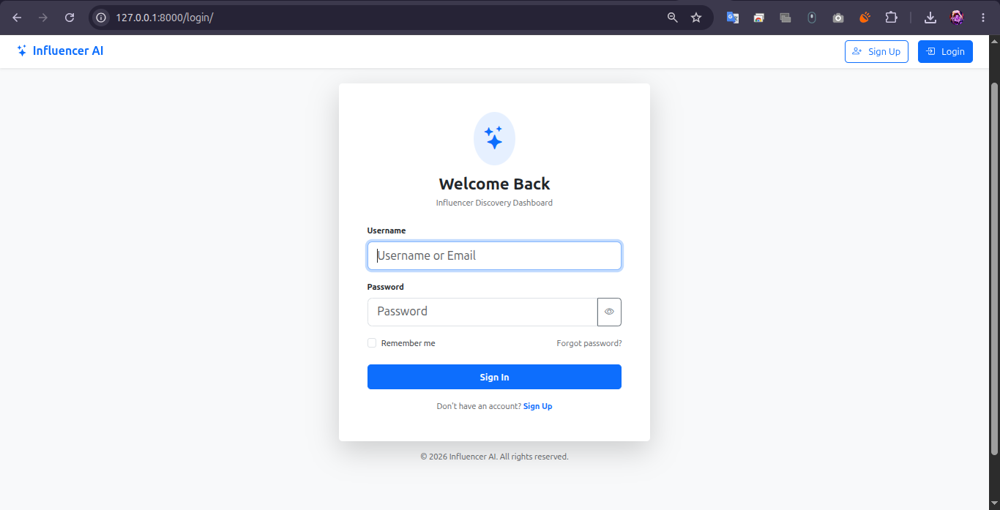 | 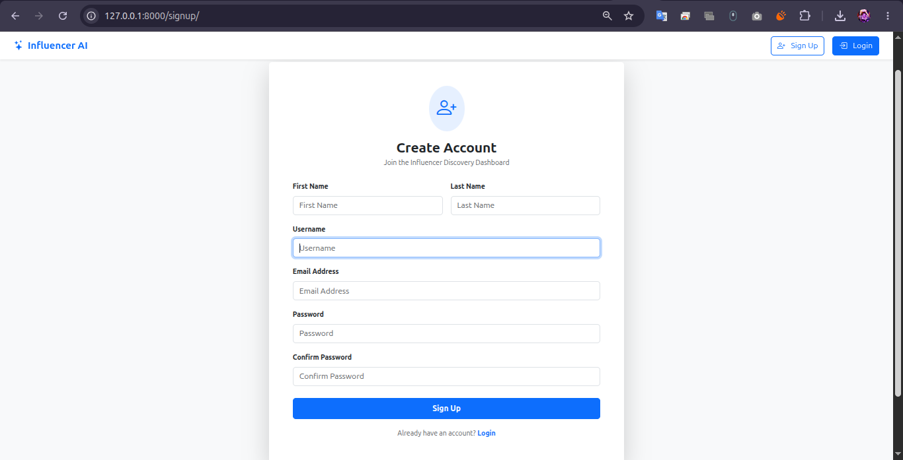 |
*Dual Username/Email sign-in interface with session-backed CSRF protection and isolated admin session handling.*

### 📊 Executive Dashboard Overview
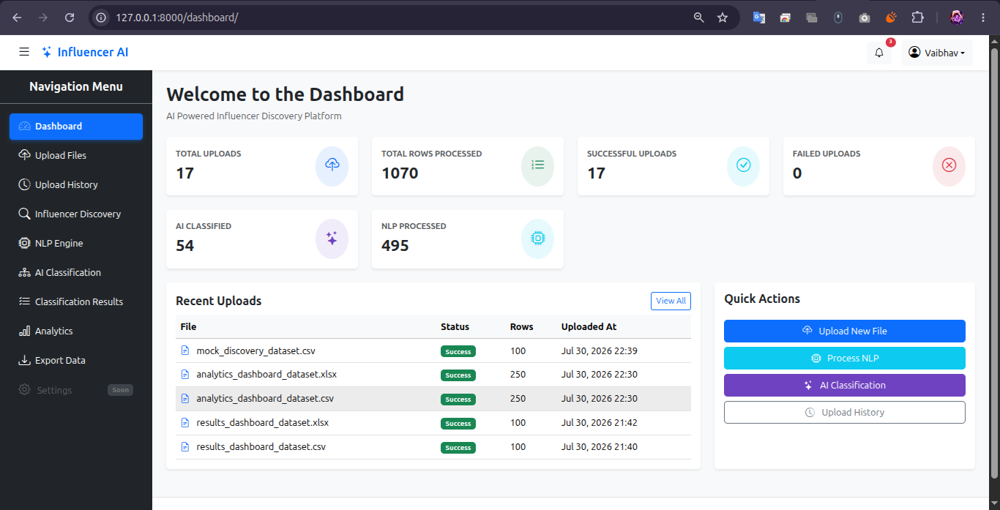
*Executive dashboard summary featuring top KPI stats, recent dataset upload logs, and active navigation controls.*

### 📁 Ingestion & Preview Module
| Multi-Format Upload Portal | Audit Log & 10-Row Data Preview |
|---|---|
| 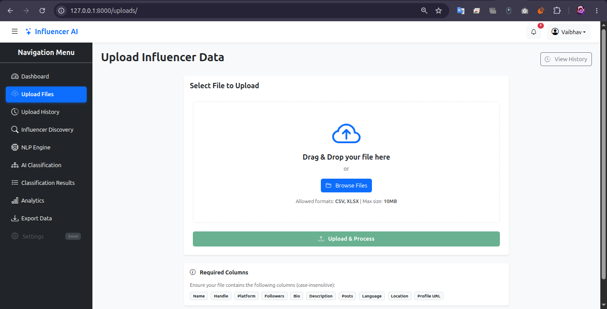 | 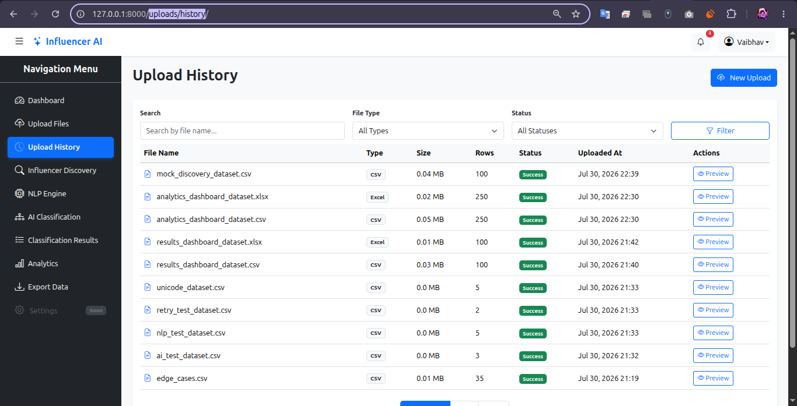 |
*Drag-and-drop CSV/Excel file drop zone featuring automatic header normalization, follower parsing, and 10-row JSON preview modal.*

### 🧠 Multilingual spaCy NLP Engine
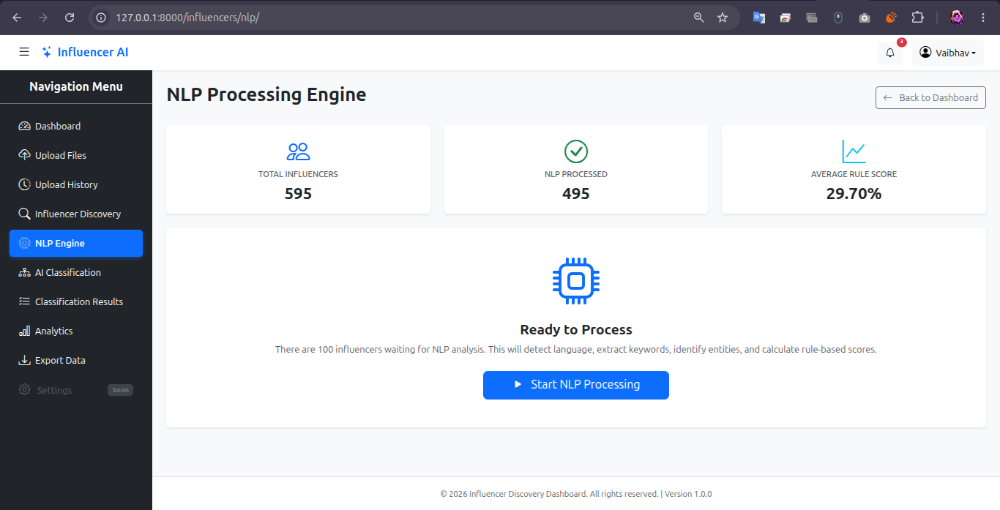
*Batch Natural Language Processing screen displaying language identification (Hindi/English/Mixed), spaCy Named Entity Recognition (NER), and domain rule scoring.*

### 🤖 Real-Time SSE AI Classification Stream
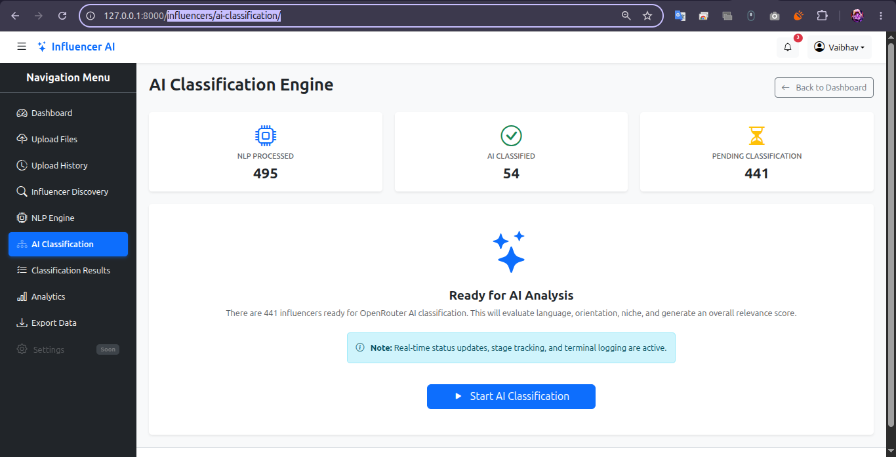
*Real-Time Server-Sent Events (SSE) progress dashboard yielding live progress bars (%), stage stepper highlights, elapsed timers, ETA estimates, and activity feed.*

### 🔍 Results Management & Creator Detail Drawer
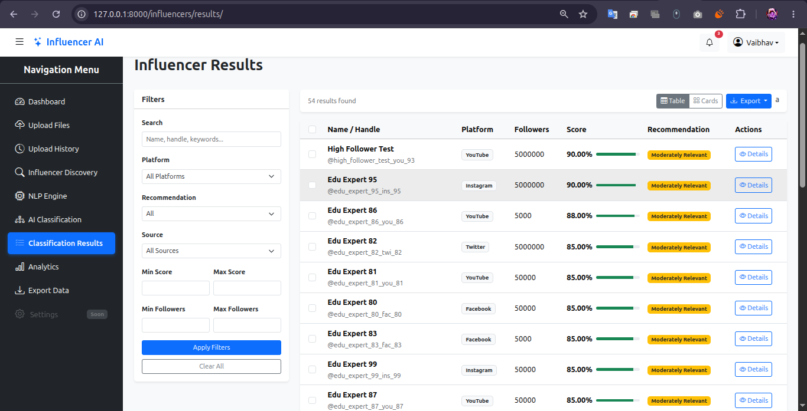
*Filterable creator results table displaying score sliders, recommendation badges (`RECOMMEND`, `MAYBE`, `REJECT`), and detailed creator evaluation profile modal.*

### 📈 Interactive Chart.js Analytics Suite
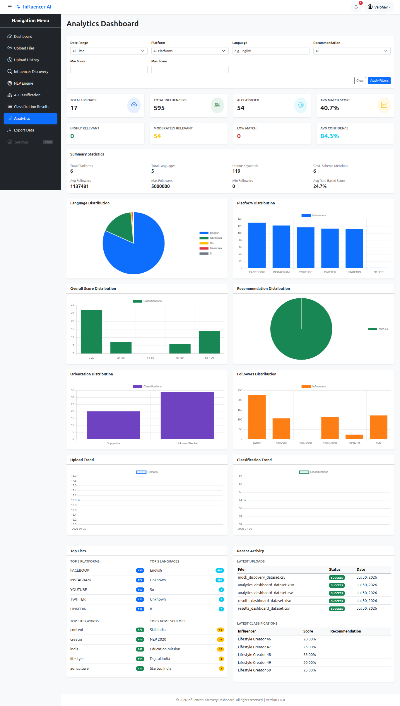
*Dynamic analytics dashboard displaying Chart.js visualizations for language distribution (doughnut), platform split (bar), score bucket histogram, and top rankings.*

### 📤 Data Export Portal

*Filter-aware export module supporting styled Excel workbooks (`.xlsx`) with auto-fitted columns and streaming UTF-8 BOM CSV files (`.csv`).*

### 🌐 Real-Time Creator Discovery Engine
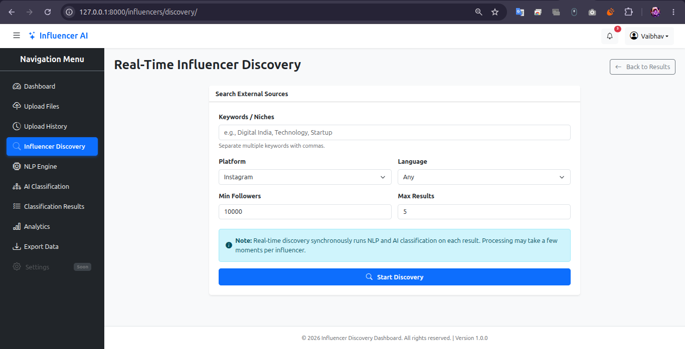
*Pluggable creator discovery portal executing keyword search queries against external providers with handle and platform deduplication.*

### 🛡️ Production Error Templates
| 404 Not Found Page | 500 Server Error Page |
|---|---|
| 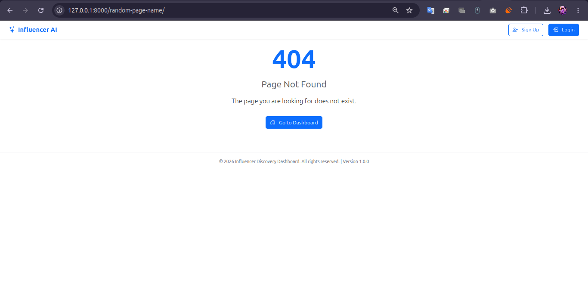 |  |
*Custom responsive HTTP 404 Not Found and 500 Internal Server Error fallback templates.*

---

## 🛠️ 5. Technology Stack


### Backend
- **Framework**: Django `6.0.7`
- **Language**: Python `3.10+` / `3.12`
- **Architecture**: Modular Django Apps (`apps/authentication`, `apps/dashboard`, `apps/uploads`, `apps/influencers`, `apps/classification`, `apps/analytics`)

### Frontend
- **Templating**: Django Template Engine (HTML5, Semantic Tags, GFM Markdown)
- **UI Framework**: Bootstrap `5.3.2`
- **Icons**: Bootstrap Icons `1.11.1`
- **Styling**: Vanilla CSS (`static/css/custom.css`) with Dark Mode Sidebar & High-Contrast Visual System
- **Scripting**: Native Vanilla JavaScript ES6 (EventSource SSE, Dynamic DOM Manipulation, Tooltips)
- **Charts**: Chart.js `4.4.1`

### Database
- **Primary Database**: PostgreSQL `15+` (Production) / SQLite3 (Development testing fallback)
- **ORM**: Django ORM with `select_related`, `prefetch_related`, `iterator()`, and `bulk_create()`

### AI & NLP Technologies
- **LLM API Provider**: OpenRouter API (`nvidia/nemotron-3-ultra-550b-a55b:free` or custom LLM)
- **AI SDK**: OpenAI Python SDK `1.65.2`
- **NLP Library**: spaCy `3.8.14` (`en_core_web_sm`)
- **Language Detection**: `langdetect` `1.0.9`

### Core Python Libraries
- **Excel Ingestion & Export**: `openpyxl` `3.1.5`, `pandas` `2.2.3`
- **HTTP Engine**: `requests` `2.32.3`, `urllib3` `2.3.0`
- **Environment Management**: `python-dotenv` `1.0.1`

---

## 🏗️ 6. Project Architecture

The architecture follows a modular, decoupled ETL and AI classification pipeline:

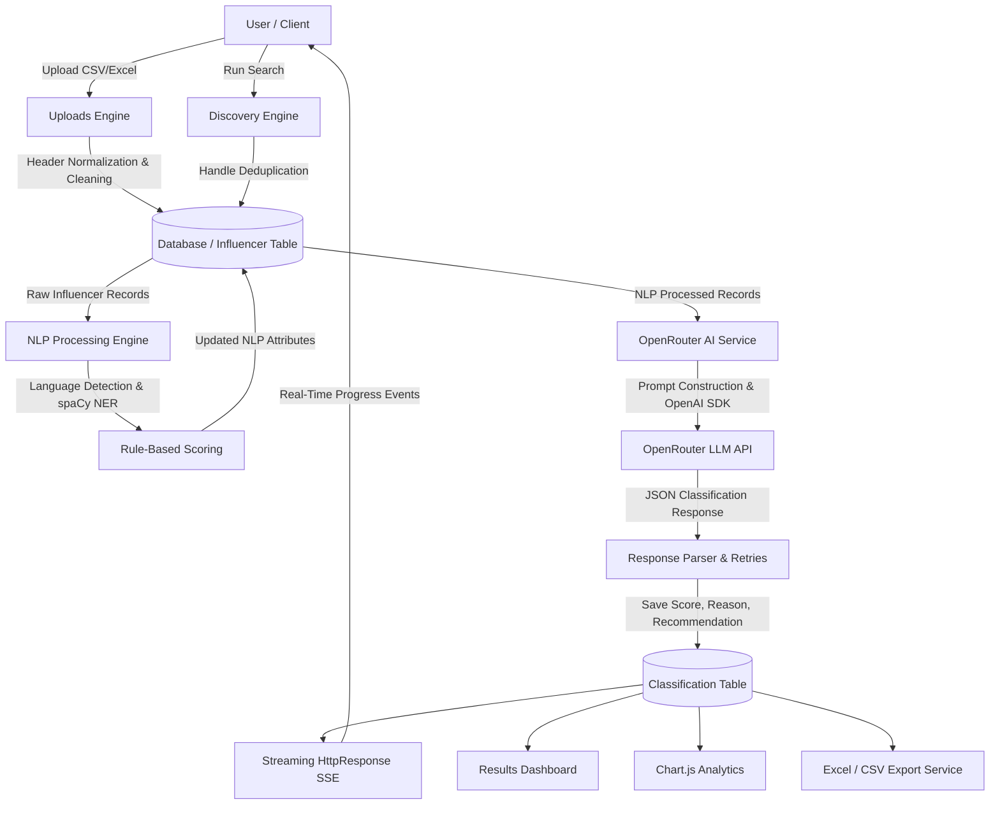

### Architectural Highlights
1. **ETL Data Separation**: File uploading, parsing, text cleaning, and follower normalization operate independently of downstream NLP or AI services.
2. **Stateless Service Layer**: OpenRouter LLM interactions, spaCy NLP analysis, and export generation are housed in dedicated `services/` modules.
3. **Real-Time SSE Feedback**: Non-blocking streaming generator yielding JSON progress events over standard HTTP without requiring Redis or Celery dependencies.

---

## 📂 7. Project Structure

```text
AI_Influence_Dashboard/
├── apps/
│   ├── analytics/                # Analytics App (Snapshots & Visualizations)
│   │   ├── models.py             # AnalyticsSnapshot Model
│   │   └── views.py              # Analytics Dashboard View
│   ├── authentication/           # Custom Auth App (User Model & Middleware)
│   │   ├── forms.py              # Login, Signup, Password Forms
│   │   ├── middleware.py         # IsolatedSessionMiddleware
│   │   ├── models.py             # Custom User Model
│   │   ├── tests.py              # Auth & Session Isolation Unit Tests
│   │   └── views.py              # Custom Login, Logout, Signup Views
│   ├── classification/           # AI Classification App
│   │   ├── models.py             # SearchCriteria & Classification Models
│   │   └── tests.py              # AI Classification Progress Stream Tests
│   ├── dashboard/                # Dashboard App (Home & Core Views)
│   │   ├── tests.py              # Navigation & Sidebar Unit Tests
│   │   └── views.py              # Home & Analytics Dashboard Views
│   ├── influencers/              # Core Influencers & Processing App
│   │   ├── forms.py              # Result Filtering & Search Forms
│   │   ├── models.py             # Influencer Model
│   │   ├── services/             # Core Business Logic Services
│   │   │   ├── discovery_service.py # Provider Architecture & Discovery
│   │   │   ├── export_service.py    # Excel & CSV Export Generators
│   │   │   ├── nlp_service.py       # spaCy NER & Rule Scoring Engine
│   │   │   ├── openrouter_service.py# OpenRouter OpenAI Client & Retries
│   │   │   ├── prompt_builder.py    # Structured JSON Prompt Formatter
│   │   │   ├── provider_manager.py  # Pluggable Provider Registry
│   │   │   ├── response_parser.py   # Markdown Cleanup & JSON Parser
│   │   │   └── result_service.py    # Filter QuerySet Builder
│   │   ├── urls.py               # Influencers URL Routes
│   │   └── views.py              # NLP, AI Stream, Results & Export Views
│   └── uploads/                  # Data Ingestion App
│       ├── models.py             # Upload Audit Model
│       ├── services.py           # File ETL & Parser Service
│       ├── tests.py              # Normalization & ETL Test Suite
│       ├── utils.py              # Header Normalization & Follower Parsing
│       └── views.py              # Upload & Preview Views
├── config/                       # Project Configuration Root
│   ├── settings.py               # Django Settings (CSRF, Middleware, Apps)
│   ├── urls.py                   # Master URL Routing Table
│   └── wsgi.py                   # WSGI Gateway Entrypoint
├── static/                       # Static Assets
│   ├── css/custom.css            # Custom Styling & Active Sidebar Theme
│   └── js/dashboard.js           # Navigation & Sidebar Drawer Script
├── templates/                    # HTML Templates
│   ├── 404.html                  # Custom 404 Page
│   ├── 500.html                  # Custom 500 Page
│   ├── analytics/                # Analytics Templates
│   ├── authentication/           # Login & Signup Templates
│   ├── base/                     # Base Layout, Navbar, Sidebar & Footer
│   ├── dashboard/                # Home Dashboard Templates
│   ├── influencers/              # AI Progress, Discovery & NLP Templates
│   ├── results/                  # Results Table, Cards & Detail Templates
│   └── uploads/                  # File Upload & Preview Templates
├── Testing/                      # QA Dataset Generators
│   ├── generate_analytics_export_qa_data.py
│   ├── generate_discovery_qa_data.py
│   ├── generate_nlp_ai_qa_data.py
│   └── generate_results_qa_data.py
├── .env.example                  # Environment Variables Schema Template
├── manage.py                     # Django Management CLI
├── README.md                     # Project Documentation
└── requirements.txt              # Python Dependencies List
```

---

## ⚡ 8. Installation Guide

Follow these steps to set up the project locally on Linux, macOS, or Windows:

### Prerequisites
- Python `3.10+` or `3.12`
- PostgreSQL `15+` (or local SQLite for quick evaluation)
- `git` version control

### 1. Clone the Repository
```bash
git clone https://github.com/SharmaVaibhav976531/AI-Influencer.git
cd AI_Influence_Dashboard
```

### 2. Create and Activate a Virtual Environment
```bash
# Linux/macOS
python3 -m venv venv
source venv/bin/activate

# Windows (Command Prompt)
python -m venv venv
venv\Scripts\activate
```

### 3. Install Dependencies
```bash
pip install --upgrade pip
pip install -r requirements.txt
```

### 4. Download spaCy Language Model
```bash
python -m spacy download en_core_web_sm
```

### 5. Configure Environment Variables
Copy `.env.example` to `.env` and fill in your configuration keys:
```bash
cp .env.example .env
```

### 6. Run Database Migrations
```bash
python manage.py migrate
```

### 7. Create Superuser (Admin Access)
```bash
python manage.py createsuperuser
```

### 8. Run Development Server
```bash
python manage.py runserver
```
Visit `http://127.0.0.1:8000/` in your browser.

---

## 🔑 9. Environment Variables

Create a `.env` file in the root directory. Below is the complete specification:

| Environment Variable | Description | Default / Example Value | Required? |
|---|---|---|---|
| `SECRET_KEY` | Django secret key for cryptographic signing | `django-insecure-change-this-in-production` | Yes |
| `DEBUG` | Enables/Disables Django debug mode | `True` | Yes |
| `ALLOWED_HOSTS` | Comma-separated list of allowed hostnames | `127.0.0.1,localhost` | Yes |
| `OPENROUTER_API_KEY` | Secret API key for OpenRouter LLM service | `sk-or-v1-xxxxxxxxxxxxxxxxx` | Yes |
| `OPENROUTER_MODEL_NAME` | Model ID used for AI classification | `nvidia/nemotron-3-ultra-550b-a55b:free` | No |
| `OPENROUTER_BASE_URL` | Base API URL for OpenRouter endpoint | `https://openrouter.ai/api/v1` | No |
| `OPENROUTER_TIMEOUT` | Timeout limit for API calls (seconds) | `30` | No |
| `OPENROUTER_MAX_RETRIES` | Max retries for failed API requests | `3` | No |

> [!CAUTION]
> Never commit your active `.env` file or API keys to version control!

---

## 📖 10. Usage Guide

### Step 1: Login to Application
Navigate to `/login/` and sign in using your registered credentials.

### Step 2: Upload Creator Data
1. Click **Upload Files** in the sidebar.
2. Drag and drop your `.csv` or `.xlsx` file into the upload zone.
3. Click **Upload & Process File**. The ETL pipeline automatically cleans text and normalizes follower counts.
4. Click **Preview Data** on the Upload History table to inspect a 10-row JSON preview.

### Step 3: Run NLP Processing
1. Click **NLP Engine** in the sidebar.
2. Click **Start Batch NLP Processing**. The system detects content language, extracts spaCy entities, and assigns domain rule scores.

### Step 4: Run AI Classification
1. Click **AI Classification** in the sidebar.
2. Click **Start AI Classification**.
3. Watch the real-time SSE progress dashboard display stage stepper updates (`Generating Prompt` ➔ `Sending Request` ➔ `Waiting for AI` ➔ `Parsing Response` ➔ `Saving Result`), live ETA timers, and detailed error logs.

### Step 5: Explore Results
1. Click **Classification Results** in the sidebar.
2. Use the search bar and filter controls to refine creators by score, platform, or recommendation.
3. Click **View Details** on any creator card to open their complete profile drawer.

### Step 6: View Analytics
Click **Analytics** in the sidebar to review language distribution dough-nuts, platform breakdown bar charts, and top creator metrics.

### Step 7: Export Reports
Click **Export Data** in the sidebar to generate a formatted Excel spreadsheet (`.xlsx`) or UTF-8 BOM CSV.

---

## 🔄 11. Workflow

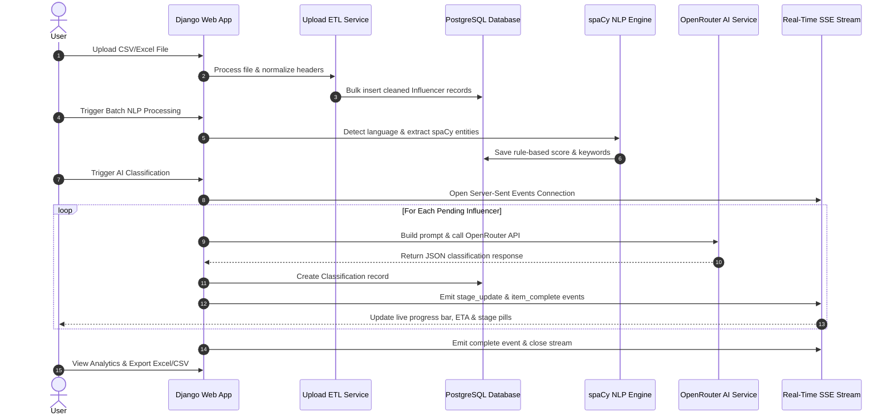

---

## 🗄️ 12. Database Design

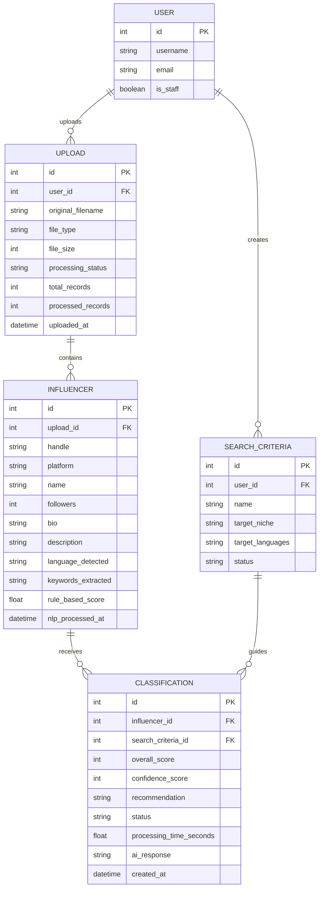


---

## 🤖 13. AI Classification

The AI classification module connects to OpenRouter via the official OpenAI Python SDK:

- **Prompt Builder** (`apps/influencers/services/prompt_builder.py`): Formats influencer bios, follower counts, and NLP scores alongside active search criteria into a structured system prompt requesting JSON output.
- **OpenRouter Service** (`apps/influencers/services/openrouter_service.py`): Invokes `client.chat.completions.create` with low temperature (`0.1`) and reasoning mode.
- **Retry Mechanism**: Implements exponential backoff (`1s`, `2s`, `4s`) for rate limits (`429`) and network timeouts.
- **Response Parser** (`apps/influencers/services/response_parser.py`): Strips markdown code block wrappers (````json ... ````) and validates key output fields.

---

## 🔬 14. NLP Engine

The NLP engine pipeline processes unclassified text through three stages:

1. **Language Identification**: `langdetect` detects content language (*Hindi*, *English*, *Mixed*).
2. **Entity & Term Extraction**: spaCy (`en_core_web_sm`) extracts Named Entities (NER) and Noun Chunks to isolate core subjects.
3. **Rule-Based Scoring**: Evaluates keyword presence across four weighted policy domains:
   - *Government Schemes* (e.g., *Digital India*, *UPI*, *PM Kisan*, *Skill India*): Weight 40%
   - *Development & Infrastructure* (e.g., *Viksit Bharat*, *Railway*, *Highway*): Weight 30%
   - *Technology & Innovation* (e.g., *AI*, *Startups*, *Coding*): Weight 20%
   - *Social & Education* (e.g., *Healthcare*, *Literacy*): Weight 10%

---

## 📊 15. Analytics

The Analytics module (`apps/analytics/` & `templates/analytics/`) renders dynamic Chart.js dashboards:

- **Language Breakdown**: Doughnut chart showing Hindi vs. English vs. Mixed language distribution.
- **Platform Split**: Bar chart breaking down creator volume across Instagram, YouTube, Twitter, LinkedIn, and Facebook.
- **Overall Score Buckets**: Distribution of AI overall scores across 0–20, 21–40, 41–60, 61–80, and 81–100 ranges.
- **Recommendation Ratios**: Pie chart detailing `RECOMMEND`, `MAYBE`, and `REJECT` classifications.

---

## 📤 16. Export System

The export module (`apps/influencers/services/export_service.py`) supports dual formats:

- **Excel Workbook (`.xlsx`)**: Generated using `openpyxl`. Features bold header rows with dark fill, auto-fitted column widths based on cell content length, center-aligned status badges, and top-row freeze panes.
- **UTF-8 BOM CSV (`.csv`)**: Generated via streaming `HttpResponse(content_type='text/csv')` with `utf-8-sig` encoding, preserving Hindi script (`हिंदी`) and emojis in Microsoft Excel without character corruption.

---

## 🌐 17. Discovery System

The Discovery module (`apps/influencers/services/discovery_service.py`) implements a pluggable provider design:

- **`BaseProvider`**: Abstract interface defining search methods.
- **`MockProvider`**: Generates realistic synthetic creators tailored to keyword queries (*Digital India*, *UPI*, *Agriculture*).
- **Deduplication Engine**: Enforces `unique_together = ('handle', 'platform')` on the `Influencer` model, skipping duplicate creator profiles automatically.

---

## 🛡️ 18. Error Handling & Logging

- **Custom HTTP Error Pages**: Production-ready custom templates for `404 Not Found` (`templates/404.html`) and `500 Internal Server Error` (`templates/500.html`).
- **Structured Django Logging**: Configured in `config/settings.py` to output formatted, color-coded console logs for ETL ingestion, NLP processing, OpenRouter retries, and SSE progress updates.

---

## 🧪 19. Testing & QA Datasets

The repository includes a comprehensive unit test suite and synthetic QA dataset generators:

### Automated Test Suites
Run all 21 unit and integration tests across apps:
```bash
python manage.py test apps.uploads.tests apps.authentication.tests apps.classification.tests apps.dashboard.tests
```

### QA Dataset Generators (`Testing/` Directory)
- `Testing/generate_nlp_ai_qa_data.py`: Generates datasets containing Hindi, English, and Mixed language profiles.
- `Testing/generate_results_qa_data.py`: Generates diverse creator records across all score brackets.
- `Testing/generate_analytics_export_qa_data.py`: Generates edge-case datasets with commas, quotes, long bios, emojis, and multiline text.
- `Testing/generate_discovery_qa_data.py`: Generates mock discovery datasets with duplicate handle validation.

---

## 🚀 20. Performance & Optimizations

- **Bulk Database Operations**: `Influencer` creation uses `Influencer.objects.bulk_create()` to reduce database round-trips during ETL file uploads.
- **Database Indexing**: Explicit database indexes on `handle`, `platform`, `language_detected`, `status`, and `nlp_processed_at`.
- **Query Memory Efficiency**: Heavy querysets use Django's `.iterator()` method to stream records from PostgreSQL without consuming excessive RAM.

---

## 🔒 21. Security & Session Isolation

- **Session Cookie Isolation**: `IsolatedSessionMiddleware` segregates Django Admin sessions (`admin_sessionid`) from regular application user sessions (`sessionid`).
- **CSRF Session Storage**: `CSRF_USE_SESSIONS = True` prevents token mismatch errors across tabs and isolated admin environments.
- **Strict Input Normalization**: All incoming text fields are stripped of illegal null characters (`\x00`) and sanitized before database persistence.

---

## 🔌 22. API Overview

Below is the routing table for all implemented application endpoints:

| App | Named Route | Path | Description |
|---|---|---|---|
| `authentication` | `login` | `/login/` | User Login View (Username/Email) |
| `authentication` | `logout` | `/logout/` | User Logout View |
| `authentication` | `signup` | `/signup/` | User Registration View |
| `dashboard` | `dashboard:home` | `/dashboard/` | Main Dashboard Overview |
| `dashboard` | `dashboard:analytics` | `/dashboard/analytics/` | Interactive Analytics Charts |
| `uploads` | `uploads:upload` | `/uploads/` | Multi-Format File Upload Portal |
| `uploads` | `uploads:history` | `/uploads/history/` | File Upload Audit Log History |
| `uploads` | `uploads:preview` | `/uploads/preview/<pk>/` | 10-Row Data Preview Modal |
| `influencers` | `influencers:nlp_dashboard` | `/influencers/nlp/` | Batch NLP Processing Trigger |
| `influencers` | `influencers:ai_classification` | `/influencers/ai-classification/` | AI Classification Dashboard |
| `influencers` | `influencers:ai_classification_stream` | `/influencers/ai-classification/stream/` | SSE Real-Time Progress Stream |
| `influencers` | `influencers:results_list` | `/influencers/results/` | Filterable Creator Results Table |
| `influencers` | `influencers:influencer_detail` | `/influencers/results/<pk>/` | Single Influencer Detail View |
| `influencers` | `influencers:export_results` | `/influencers/results/export/` | Formatted Excel/CSV Export Endpoint |
| `influencers` | `influencers:discovery` | `/influencers/discovery/` | Real-Time Creator Discovery Portal |

---

## 📌 23. Known Limitations

1. **Synchronous Ingestion Execution**: File processing and NLP jobs run synchronously in the web process, which can delay HTTP responses for very large files (>50,000 rows).
2. **OpenRouter Free Tier Rate Limits**: Third-party API rate limits on free models may trigger exponential backoff pauses during large AI classification runs.
3. **Mock Discovery Engine**: The current Discovery module utilizes a `MockProvider` pending integration with live social platform Graph APIs.

---

## 🔮 24. Future Improvements

- [ ] **Asynchronous Task Queue**: Integrate Celery and Redis to move ETL parsing, spaCy NLP, and OpenRouter classification jobs to background workers.
- [ ] **Live Social API Connectors**: Add official YouTube Data API v3 and Instagram Graph API provider connectors.
- [ ] **PDF Executive Summaries**: Add automated PDF export for client campaign presentations.
- [ ] **Multi-Tenant Team Workspaces**: Role-Based Access Control (RBAC) allowing teams to collaborate on shared creator lists.

---

## 🤝 25. Contributing

Contributions are welcome! Please follow these steps:

1. Fork the repository.
2. Create a feature branch: `git checkout -b feature/amazing-feature`
3. Commit your changes: `git commit -m 'Add amazing feature'`
4. Push to the branch: `git push origin feature/amazing-feature`
5. Open a Pull Request.

---

## 📜 26. License

This project is open-source software licensed under the [MIT License](LICENSE).

---

## 👨‍💻 27. Author

**Vaibhav Sharma**
- GitHub: [@SharmaVaibhav976531](https://github.com/SharmaVaibhav976531)
- Repository: [AI-Influencer](https://github.com/SharmaVaibhav976531/AI-Influencer)

---

## 🙏 28. Acknowledgements

- [Django Software Foundation](https://www.djangoproject.com/)
- [spaCy Natural Language Processing](https://spacy.io/)
- [OpenRouter AI](https://openrouter.ai/)
- [Chart.js](https://www.chartjs.org/)
- [Bootstrap 5](https://getbootstrap.com/)
- [openpyxl](https://openpyxl.readthedocs.io/)

---

## 🚦 29. Project Status

| Metric | Status |
|---|---|
| **Production Ready** | ✅ Yes |
| **Current Phase** | Completed / Verified |
| **Automated Tests** | 21 / 21 Passed (100%) |
| **Core Modules Implemented** | Auth, ETL Upload, NLP, AI Stream, Analytics, Export, Discovery |